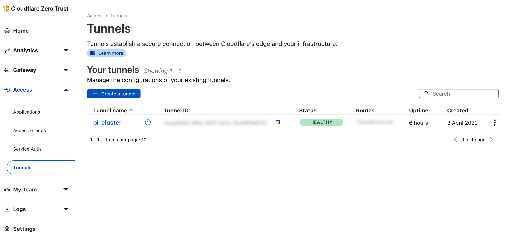
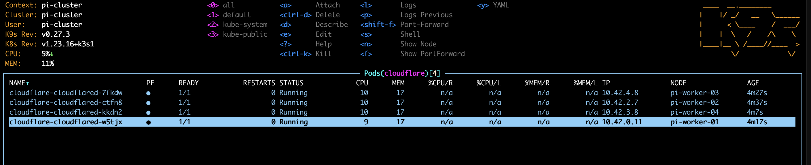

# Cloudflare Tunnel Example for Raspberry Pi Cluster

Welcome to this example project for setting up a [Cloudflare Tunnel](https://www.cloudflare.com/products/tunnel/) on a home [Raspberry Pi](https://www.raspberrypi.org/) cluster! This guide assumes you have a Raspberry Pi cluster running with [K3s](https://k3s.io/) installed using the [K3s Ansible script](https://github.com/k3s-io/k3s-ansible). Note that the K3s installation is not covered in this example. For additional guidance, you may find [Nima Mahmoudi's blog post](https://itnext.io/using-cloudflare-tunnels-to-securely-expose-kubernetes-services-26713fb5da0a) and [Cloudflare's official Kubernetes example](https://github.com/cloudflare/argo-tunnel-examples/tree/master/named-tunnel-k8s) helpful for building your solution.

Great news! The [official Cloudflare Docker Hub repository](https://hub.docker.com/r/cloudflare/cloudflared) now supports the arm64 architecture, so you can confidently use the official images for your Raspberry Pi setup. This Helm chart has been updated to leverage these images. Feel free to explore and use this chart to simplify your Cloudflare Tunnel deployment. Happy deploying!

## Production Usage

For production environments, we recommend using the well-maintained [community-charts Cloudflared Helm chart](https://artifacthub.io/packages/helm/community-charts/cloudflared) instead of this example chart. It offers robust features and ongoing support from the community, ensuring a reliable and secure deployment.

- **Helm Chart**: [Cloudflared on ArtifactHub](https://artifacthub.io/packages/helm/community-charts/cloudflared)
- **Documentation**: [Official Community Charts Documentation](https://community-charts.github.io/docs/charts/cloudflared/usage)
- **Source Code**: [Community Charts GitHub Repository](https://github.com/community-charts/helm-charts/tree/main/charts/cloudflared)

## Install the Cloudflare CLI

To get started, install the Cloudflare CLI (`cloudflared`) on your local machine:

```bash
brew update && brew install cloudflared
```

## Log In to Cloudflare and Create a Tunnel

Authenticate with Cloudflare and create a tunnel for your Raspberry Pi cluster:

```bash
cloudflared tunnel login
```

```bash
cloudflared tunnel create pi-cluster
```

## Deploy the Cloudflare Tunnel to Your Raspberry Pi Cluster

You can deploy the Cloudflare Tunnel to your Kubernetes cluster using the provided Helm chart. Simply run the following command to execute the deployment script:

```bash
./run.sh
```

Alternatively, if you prefer manual deployment, copy your tunnel credentials to the `files` folder and run the following Helm command:

```bash
helm upgrade --install \
  --namespace cloudflare \
  --create-namespace \
  cloudflare \
  ./charts/cloudflared
```

### Customizing Your Deployment

You can customize your deployment by creating a `values.yaml` file to specify your settings. Below is an example `values.yaml` configuration:

```yaml
replica:
  allNodes: true

tunnelConfig:
  name: "pi-cluster"
  protocol: quic

ingress:
  - hostname: "*.example.com"
    service: http://traefik.kube-system.svc.cluster.local:80
  - service: http_status:404
```

Note: Changes to the `values.yaml` file are ignored in this repository to maintain consistency.

## Screenshots

### Cloudflare Tunnel Dashboard



### Raspberry Pi Cluster


